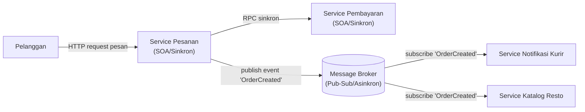

# Tugas 2 — Perancangan Arsitektur untuk FoodGo

**Kelompok:** [7 - mafia dodol gresik]

| Nama | NIM | Kontribusi |
|---|---|---|
| [RIDHO BINTANG ADWITYA] | [103072400015] | Alur Skenario End-to-End |
| [RANGGA DANI PRASETYA] | [103072400057] | Analisis Masalah Coupling dan Trade-off |
| [RESTU FADILAH AL FATAH] | [103072400081] | Pemilihan & Justifikasi Arsitektur |
| [ALBERTRIO SURANTA GINTING] | [103072400128] | Desain Diagram Arsitektur (Mermaid) |

## 1. Pemilihan Gaya Arsitektur
Gaya Terpilih: Kombinasi Service-Oriented Architecture (SOA) dan Publish-Subscribe (Event-Driven)

Justifikasi:
Penggabungan ini dirancang untuk menjaga keseimbangan antara konsistensi data dan otonomi sistem. SOA menangani alur transaksi utama secara sinkron untuk menjamin kepastian data seketika (seperti pengecekan harga di Modul Katalog dan pemotongan saldo di Modul Pembayaran). Adapun proses lanjutan, seperti pendelegasian tugas ke kurir dan pemberitahuan ke restoran, diproses secara asinkron melalui pola Publish-Subscribe. Langkah ini mencegah latency pada Modul Pesanan akibat menunggu proses eksternal selesai.

---

## 2. Diagram Komponen

---

## 3. Alur Skenario End-to-End

---

## 4. Analisis Masalah Coupling dan Trade-off

---

## Kesimpulan Kelompok

