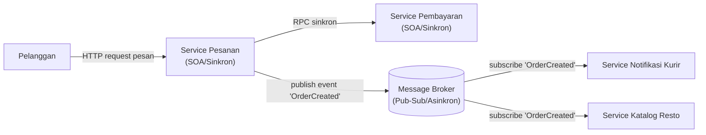

# Tugas 2 — Perancangan Arsitektur untuk FoodGo

**Kelompok:** [7 - mafia dodol gresik]

| Nama | NIM | Kontribusi |
|---|---|---|
| [RIDHO BINTANG ADWITYA] | [103072400015] | Alur Skenario End-to-End |
| [RANGGA DANI PRASETYA] | [103072400057] | Analisis Masalah Coupling dan Trade-off |
| [RESTU FADILAH AL FATAH] | [103072400081] | Pemilihan & Justifikasi Arsitektur |
| [ALBERTRIO SURANTA GINTING] | [103072400128] | Desain Diagram Arsitektur (Mermaid) |

## 1. Pemilihan Gaya Arsitektur
Gaya Terpilih: Kombinasi Service-Oriented Architecture (SOA) dan Publish-Subscribe (Event-Driven)

Justifikasi:
Penggabungan arsitektur ini dirancang untuk menjaga keseimbangan antara kepastian transaksi kritis dan independensi proses pendukung. Pendekatan Service-Oriented Architecture (SOA) melalui jalur sinkron diterapkan secara khusus pada komunikasi langsung antara Modul Pesanan dan Modul Pembayaran via RPC, karena alur ini menuntut kepastian status pembayaran secara real-time sebelum pesanan resmi diproses oleh sistem. Setelah pembayaran dinyatakan sukses, sistem beralih menggunakan pola asinkron (Publish-Subscribe), di mana Modul Pesanan cukup menerbitkan (publish) sebuah event OrderCreated ke Message Broker. Selanjutnya, Modul Katalog Resto yang menangani penerimaan pesanan dan pembaruan stok, bersama dengan Modul Notifikasi Kurir yang bertugas mencari dan mengalokasikan armada, akan bertindak sebagai subscriber yang menerima dan memproses event tersebut secara terpisah dan mandiri.

---

## 2. Diagram Komponen

---

## 3. Alur Skenario End-to-End
1. Inisiasi Pesanan (Sinkron): Ketika pelanggan menekan tombol pemesanan pada antarmuka aplikasi, client akan mengirimkan data pesanan ke Modul Pesanan menggunakan metode HTTP POST dengan pola komunikasi request-response.
2. Validasi Keranjang (Sinkron): Selanjutnya, Modul Pesanan melakukan pemanggilan ke Modul Katalog Resto melalui HTTP GET. Langkah ini bertujuan untuk memverifikasi ketersediaan menu serta kesesuaian harga. Pada tahap ini, Modul Pesanan akan menahan proses eksekusi hingga menerima respons validasi dari Modul Katalog.
3. Pemrosesan Pembayaran (Sinkron): Setelah data pesanan tervalidasi, Modul Pesanan meneruskan permintaan ke Modul Pembayaran via HTTP POST untuk mendebit saldo e-wallet pelanggan. Sistem akan menunggu hingga mendapat konfirmasi status transaksi "Berhasil" sebelum melangkah ke tahap berikutnya.
4. Publikasi Event (Asinkron): Segera setelah pembayaran berhasil diproses, Modul Pesanan mempublikasikan sebuah event (misalnya: OrderPaid) ke Message Broker. Secara bersamaan, Modul Pesanan langsung memberikan respons "Pesanan Sukses" kepada aplikasi pelanggan. Pendekatan asinkron ini memastikan user experience yang responsif karena sistem tidak perlu menunggu proses lanjutan dari pihak restoran maupun kurir.
5. Tindak Lanjut Restoran dan Kurir (Asinkron): Modul Katalog Resto dan Modul Kurir yang telah berlangganan pada topic tersebut akan menerima event OrderPaid dari Message Broker secara paralel. Modul Katalog Resto kemudian memicu notifikasi pesanan masuk pada perangkat restoran. Di waktu yang bersamaan, Modul Kurir mengeksekusi algoritma pencarian lokasi untuk menugaskan driver terdekat agar segera menjemput pesanan.

---

## 4. Analisis Masalah Coupling dan Trade-off

---

## Kesimpulan Kelompok

