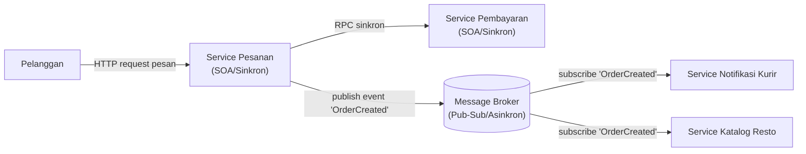

# Tugas 2 — Perancangan Arsitektur untuk FoodGo

**Kelompok:** [7 - mafia dodol gresik]

| Nama | NIM | Kontribusi |
|---|---|---|
| [RIDHO BINTANG ADWITYA] | [103072400015] | Alur Skenario End-to-End |
| [RANGGA DANI PRASETYA] | [103072400057] | Analisis Masalah Coupling dan Trade-off |
| [RESTU FADILAH AL FATAH] | [103072400081] | Pemilihan & Justifikasi Arsitektur |
| [ALBERTRIO SURANTA GINTING] | [103072400128] | Desain Diagram Arsitektur (Mermaid) |

## 1. Pemilihan Gaya Arsitektur

---

## 2. Diagram Komponen

---

## 3. Alur Skenario End-to-End

---

## 4. Analisis Masalah Coupling dan Trade-off

---

## Kesimpulan Kelompok

