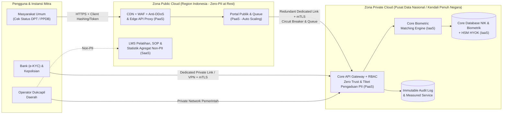

```mermaid
flowchart LR
    subgraph Pengguna["Pengguna & Instansi Mitra"]
        P1["Masyarakat Umum\n(Cek Status DPT / PPDB)"]
        P2["Bank (e-KYC) &\nKepolisian"]
        P3["Operator Dukcapil\nDaerah"]
    end

    subgraph PublicCloud["Zona Public Cloud (Region Indonesia - Zero-PII at Rest)"]
        Edge["CDN + WAF + Anti-DDoS\n& Edge API Proxy (PaaS)"]
        Portal["Portal Publik & Queue\n(PaaS - Auto Scaling)"]
        SaaS["LMS Pelatihan, SOP &\nStatistik Agregat Non-PII (SaaS)"]
    end

    subgraph PrivateCloud["Zona Private Cloud (Pusat Data Nasional / Kendali Penuh Negara)"]
        APIGW["Core API Gateway + RBAC\nZero Trust & Tiket Pengaduan PII (PaaS)"]
        Match["Core Biometric\nMatching Engine (IaaS)"]
        CoreDB[("Core Database NIK & Biometrik\n+ HSM HYOK (IaaS)")]
        Audit[("Immutable Audit Log\n& Measured Service")]
    end

    P1 -->|HTTPS + Client Hashing/Token| Edge --> Portal
    Portal -->|Redundant Dedicated Link + mTLS\nCircuit Breaker & Queue| APIGW
    P2 -->|Dedicated Private Link / VPN + mTLS| APIGW
    P3 -->|Private Network Pemerintah| APIGW
    P3 -.->|Non-PII| SaaS
    APIGW --> Match --> CoreDB
    APIGW --> Audit
```